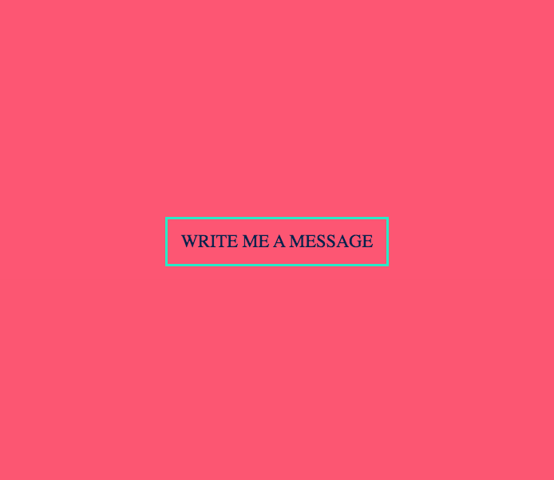
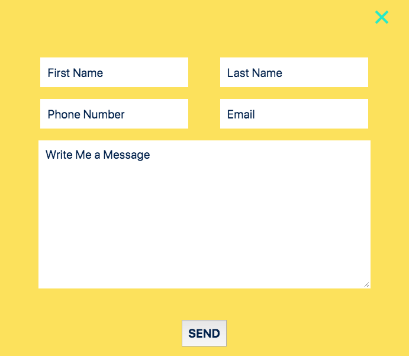

# The Ultimate Form

a form validation example

## Technologies Used

1. HTML5
2. Sass/CSS
3. JavaScript
4. Form Validation
5. reCaptcha 

## Useful Notes / Links

[HTML5 input types](https://developer.mozilla.org/en-US/docs/Learn/Forms/HTML5_input_types)

[CSS Tricks Form Validation](https://css-tricks.com/form-validation-part-1-constraint-validation-html/)

## Planning
1. Validations
2. Front of card
3. Back of card - needs to be responsive
4. ReCaptcha - self made / mimics what Google recaptcha v3 does
5. SVGs
6. Colors - [Happy Hues](https://www.happyhues.co/palettes/2)
7. Clear items if user clicks back on them.

## Images: 

Front

Back

### reCaptcha Notes
This form uses a similar Google reCaptcha v3 in that there is a hidden input field in the form. Bots are attracted to this field and when they fill it out and submit the form, the form is not sent. Unlike traditional reCaptcha which can be ugly and distracting to users, this reCaptacha is invisible.

